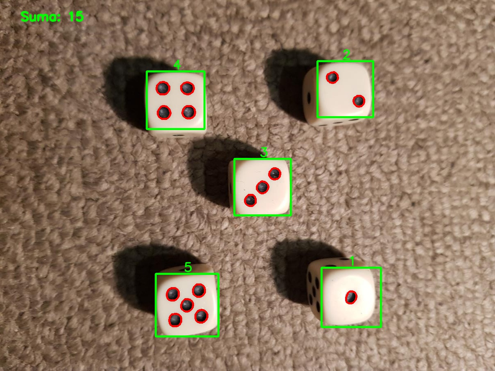

<!-- MARKDOWN LINKS & IMAGES -->

[status-icon]: https://img.shields.io/badge/status-active-success.svg
[project-url]: https://github.com/DamianTab/dice-detection
[issues-icon]: https://img.shields.io/github/issues/DamianTab/dice-detection.svg
[issues-url]: https://github.com/DamianTab/dice-detection/issues
[pulls-icon]: https://img.shields.io/github/issues-pr/kylelobo/The-Documentation-Compendium.svg
[pulls-url]: https://github.com/DamianTab/dice-detection/pulls
[license-icon]: https://shields.io/badge/license-Apache%202-blue.svg
[license-url]: /LICENSE
[author-url]: https://github.com/DamianTab

<p align="center">
  <a href="" rel="noopener">
 </a>
</p>


<h3 align="center">dice-detection</h3>

<div align="center">
  
  [![Status][status-icon]][project-url]
  [![GitHub Issues][issues-icon]][issues-url]
  [![GitHub Pull Requests][pulls-icon]][pulls-url]
  [![License][license-icon]][license-url]
</div>

---

<p align="center"> Live detecting pips on dices.
    <br> 
</p>

## 📝 Table of Contents
- [About](#about)
- [Technologies](#technologies)
- [Getting Started](#getting_started)
- [Usage](#usage)
- [Deployment](#deployment)
- [Authors](#authors)
- [Acknowledgments](#acknowledgement)

<br/>

## 🧐 About <a name = "about"></a>
Simple project that allows to detect dices on photos or live camera and sum number of all visible pips.


Eaxmples:





<br/>

## ⛏️ Technologies <a name = "technologies"></a>
- Python v3

<br/>
  
## 🏁 Getting Started <a name = "getting_started"></a>
These instructions will help you set up and run project on your local machine for development and testing purposes. See [deployment](#deployment) for notes on how to deploy the project on a live system.

<br/>
  
### Prerequisites
What things you need to install the software and how to install them.

```
python v3
numpy
cv2
math (python library)
```
<br/>


The easiest way to install all libraries is to type:
```
pip3 install <package>
```
<br/>

### Running
To run code just type:
```
python3 main.py
```


<br/>


## 🎈 Usage <a name="usage"></a>
There are two main functions. Frist one `main_photos()` detected dices from photos in folder `myphotos` with extension `.jpg` . Second one `main_camera()` is responsible for capturing the camera source and showing live results of detection.

To switch between modes -> un/comment one of the entry. 

Note: You can always import the function to your own code.

<br/>

## 🚀 Deployment <a name = "deployment"></a>
No available deployment method.

<br/>


## ✍️ Authors <a name = "authors"></a>
- [@DamianTab][author-url]

<br/>

## 🎉 Acknowledgements <a name = "acknowledgement"></a>
